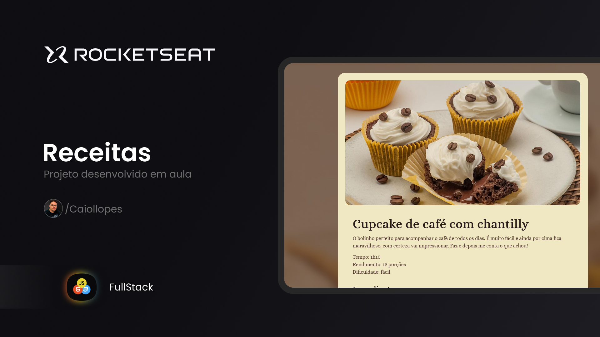

<h1 align="center"> Receitas </h1>

 

  

## 💻 Projeto

Receitas é um projeto desenvolvido em aula para praticar os ensinamentos passado em aula.

## 📚 Aprendizado

Neste projeto eu aprendi:

- Estrura HTML inicial
- Boas praticas
- Espaçamentos, tipografia e imagens utilizando o CSS

## 🚀 Tecnologias

Esse projeto foi desenvolvido com as seguintes tecnologias:

- HTML e CSS
- Git e Github
- Figma

## 🔖 Web site

Você pode visualizar este projeto 
<a href="https://caiollopes.github.io/receitas-rks/" target="_blank">Clicando aqui!</a>
